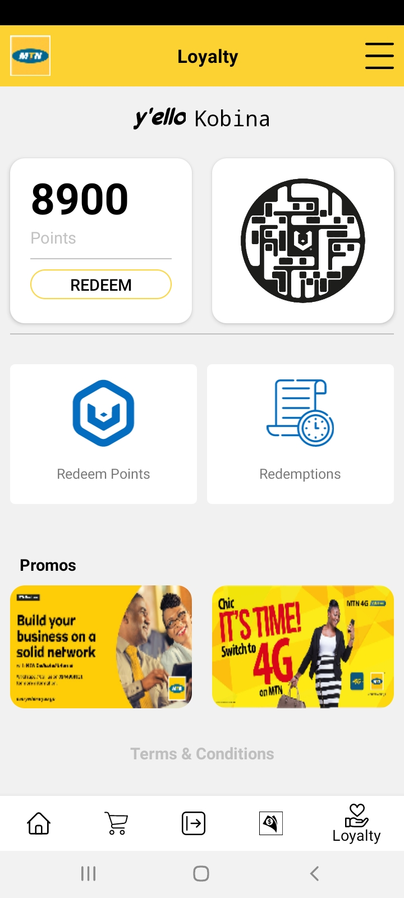
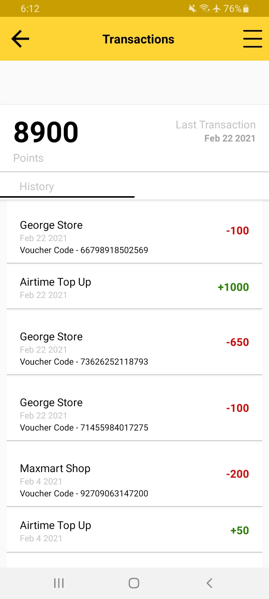
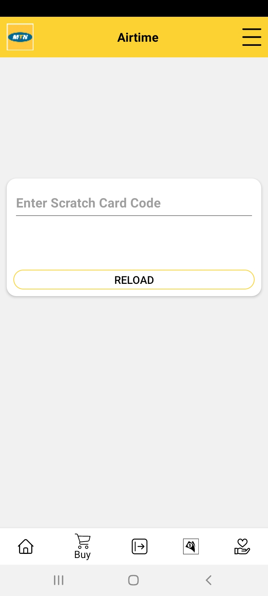
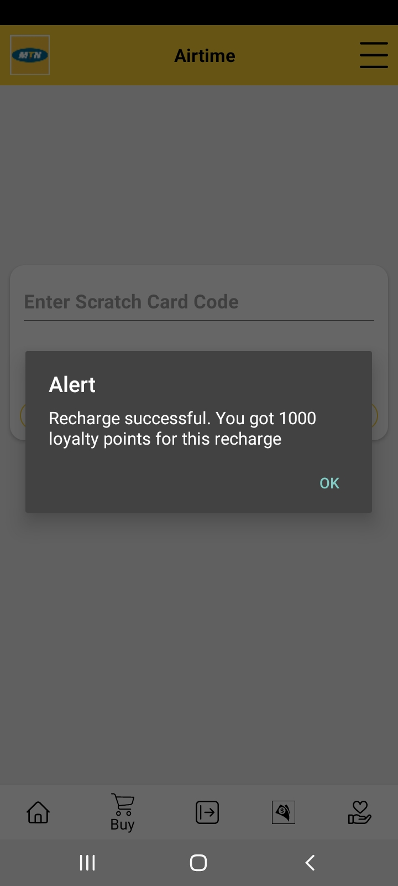
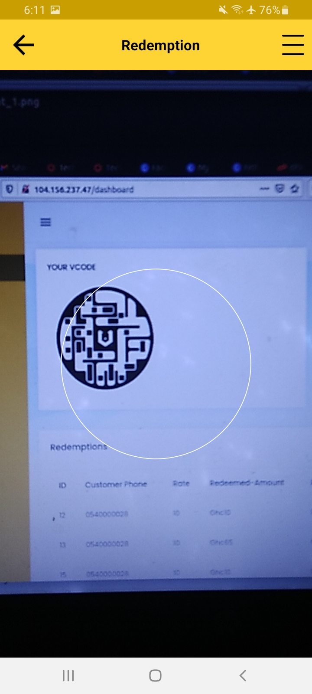
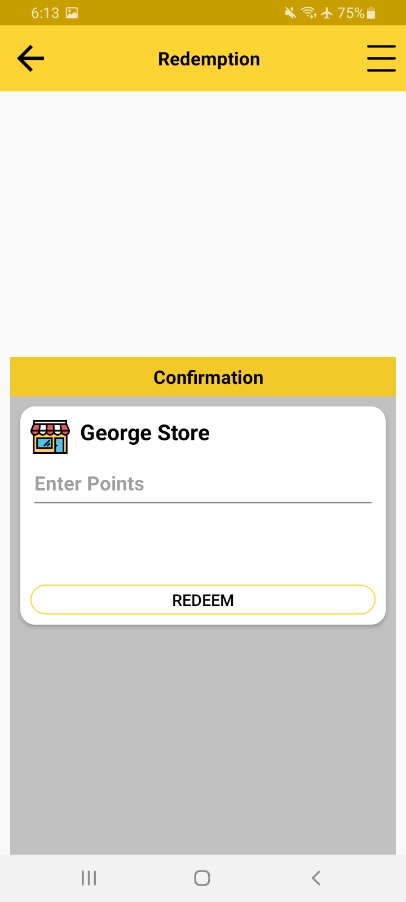
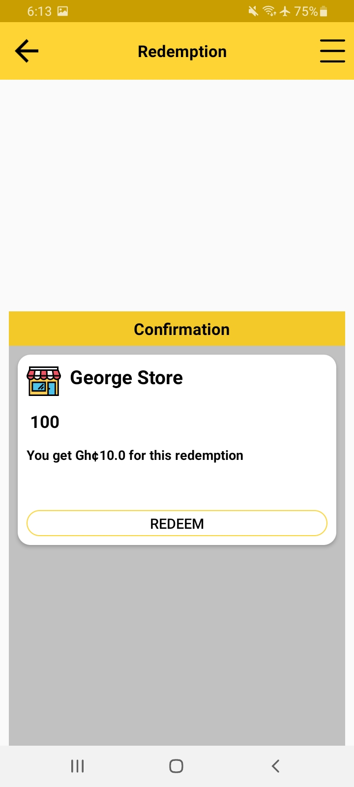
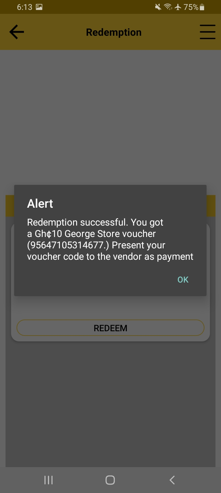

# MOBILE CUSTOMER LOYALTY - VCODE
**Rewarding MTN Telecom customers for their loyalty**

## Features
* Get A VCODE to identify your loyalty account
* Collect points as you buy airtime or do mobile money transactions
* Scan vendor VCODEs
* Redeem points with vendors
* View all point transactions


### USAGE
```
Available soon on the MTN App .
```
## Screenshots
</br>
<div align="center">
   <table align="center" border="0" >
  <tr>
    <td>
      
    <td>
      
    </td>
    <td> 
     
    </td>
  </table>
  </div>
</br>
<div align="center">
  <table align="center" border="0" >
  <tr>
    <td> 
     
    </td>
    <td> 
     
    </td>
    <td> 
     
    </td>
  </tr>
</table>
  </div>
</br>
<div align="center">
  <table align="center" border="0" >
  <tr>
    <td> 
     
    </td>
    <td> 
     
    </td>
     <td> 
      
     </td>
  </tr>
</table>
  </div>
</br>

## Authors

* **Dankyi Anno Kwaku** - *ShrinQ Company Limited*


